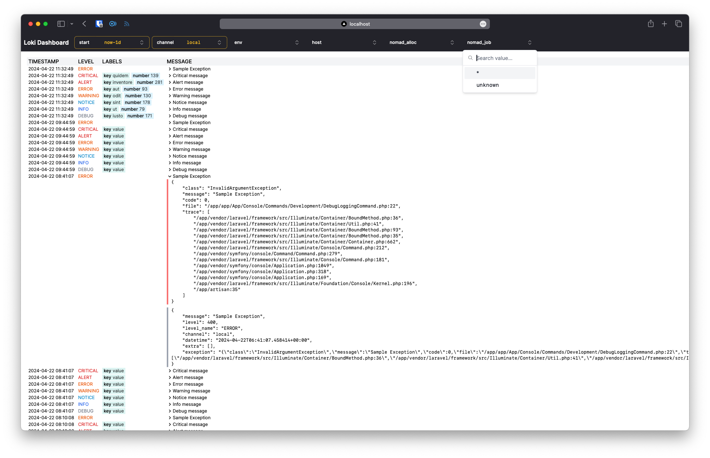

# Loki Dashboard

An alternative **Dashboard** Frontend and **Logs Browser** for [Grafana Loki](https://grafana.com/oss/loki/).



### Features

- See all ingested into Loki
- Automatic fetching of labels & handy filtering
- Store current filter state in URL, set bookmarks for dashboards
- Parsing of exceptions & additonal data
- Cusomtizable UI

## Setup

The project is built as a [Docker container](https://github.com/romanzipp/Loki-Dashboard/pkgs/container/loki-dashboard) via the GitHub `ghcr.io` container registry.

### Docker

The default port `3000` will be expoed.

```
docker pull ghcr.io/romanzipp/loki-dashboard:latest
```

```
docker run -e "LOKI_ENTRYPOINT=http://localhost:3100" -p 3000:3000 romanzipp/loki-dashboard:latest
```

### Nomad (with Docker)

```
TODO
```

## Configuration

#### `LOKI_ENTRYPOINT` (default: `http://localhost:3100`)

The Loki instance base url.

#### `COLORED_ROWS` (default: false)

Color rows with the according level color.

#### `COLORED_ROWS_LEVEL_THRESHOLD` (default: null)

If `COLORED_ROWS` is enabled, only add background to rows with a level larger or equal than the set value.

## License

[MIT License](LICENSE.md)

## Authors

- [Roman Zipp](https://romanzipp.com)

